theme: Ostrich, 0
autoscale: true
build-lists: true

## My dear **DESIGNER**... 
### ...with **LOVE**... 
## Your **DEVELOPER**...

^ John Keats was an English Romantic poet and in one of his most famous letters, he tells next door neighbor Fanny Brawne he cannot live without her (1819): "My love has made me selfish. I cannot exist without you - I am forgetful of every thing but seeing you again."
This hidden love between developers and designers really exists and we must take advantage of it in order to design and develop great products.
Jump onboard in this journey and let's explore this charming relationship, based on real use cases and experiences for creating awesome product features and functionalities.

---

# Disclaimer **One**

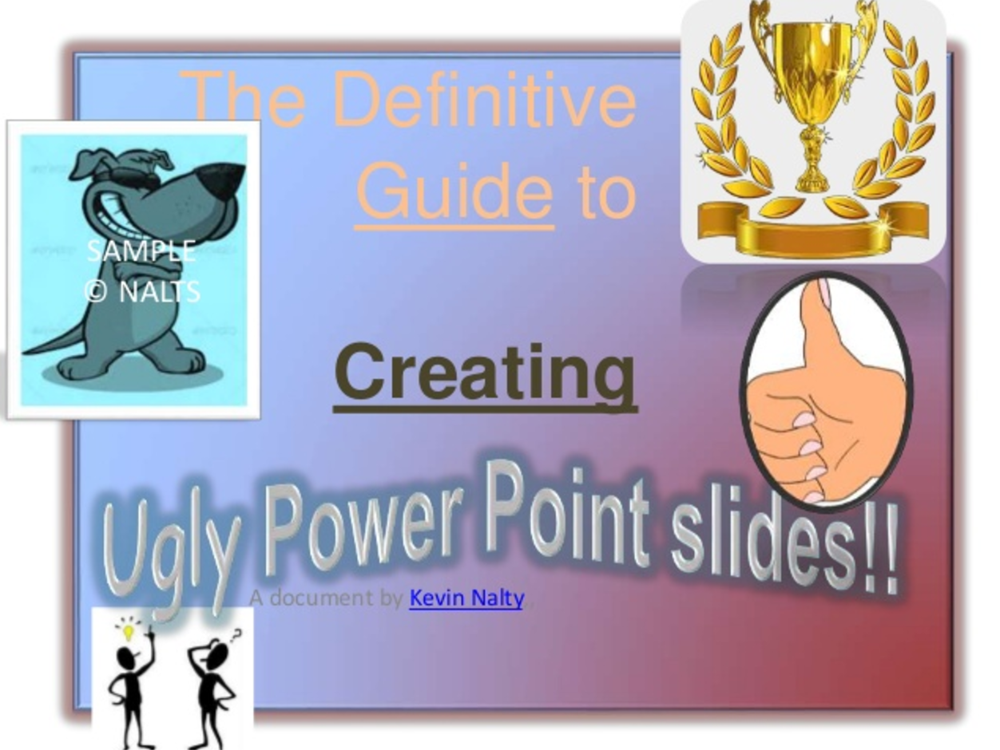

^ Disclaimer One: This is a "minimalist" presentation.

---

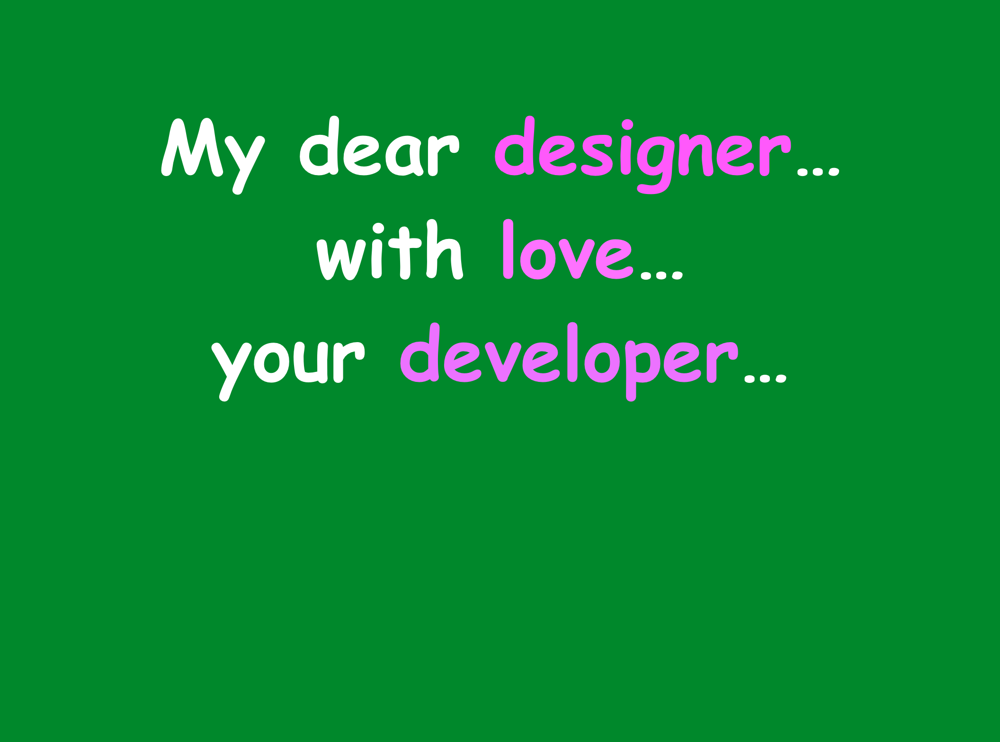 

^ This was the original cover. Using Comic Sans. Pixel perfect.
And you can also geocitize a web: http://www.wonder-tonic.com/geocitiesizer/

---

# **Meet @fernando_cejas**

- Curious learner
- Software engineer
- Speaker
- Work at @soundcloud
- fernandocejas.com

^ When I really have something to say, I either create a presentation or write a post.
^ Most valuable information comes from experiences.
^ This talk is basically to avoid you guys to bang your head against a brick wall as I did in the past.

---

## Why **THIS TALK?**

^ This talk was inspired by reading and learning from personal experiencies. The  key idea is that you get also some inspiration out of it.

---

## Android Design for fun and profit

^ Last time I talked seriously about design was in 2013: https://speakerdeck.com/android10/android-ux-ui-design-patterns 
Then in 2015 I talked about material design, at a more technical level, but still with a huge hangover after the conference's party the previous night.

---

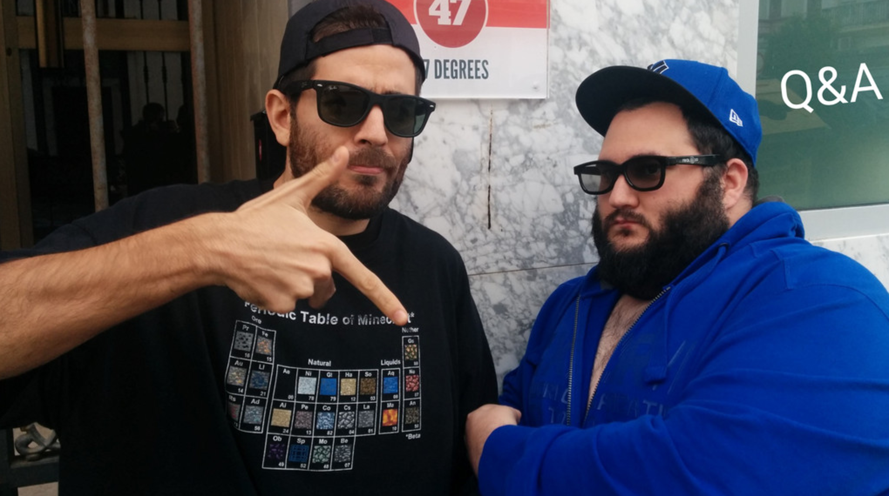

## Material Design for old schoolers

^ Then in 2015 I talked about material design, at a more technical level, but still with a huge hangover after the conference's party the previous night.

---

### Disclaimer **Two**
#### Currently I do not work at product design level...

^ Disclaimer Two: I'm not currently working with designers as I'm part of core engineering but... 

---

### Product **Evolution**

# 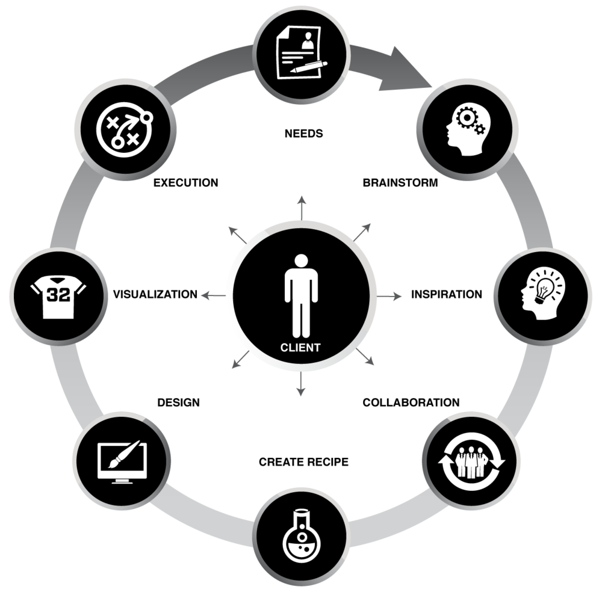

^ Products are way bigger nowadays. Needs and requirements are way more complex. 
What are the parts involved nowadays in Product? Product, Management, Businness, Desing, Development. 

---

### This **story** is only for 
### **designers** and **developers** 

---

### What is **UI** Design?
### What is **Interaction** Design?
### What is **Visual** Design?

---

### "**UI design** is all about getting users as familiar with your app in as **little time** and with as **little brainpower** as possible"
#### by Kevin Tomasso

^ Kevin Tomasso: "UI design is all about getting users as familiar with your app in as little time, and with as little brainpower as possible".

---

### Hello World **Mobile Product Designer**

^ Definition: It is someone that assembles de puzzle and put all the pieces together. It is more on the side of visual and UX, rather than implementation details. Coordination. Can also create deliverables. 
^ https://medium.com/yalantis-design/role-of-a-product-designer-in-app-development-process-2d755ef57489

---

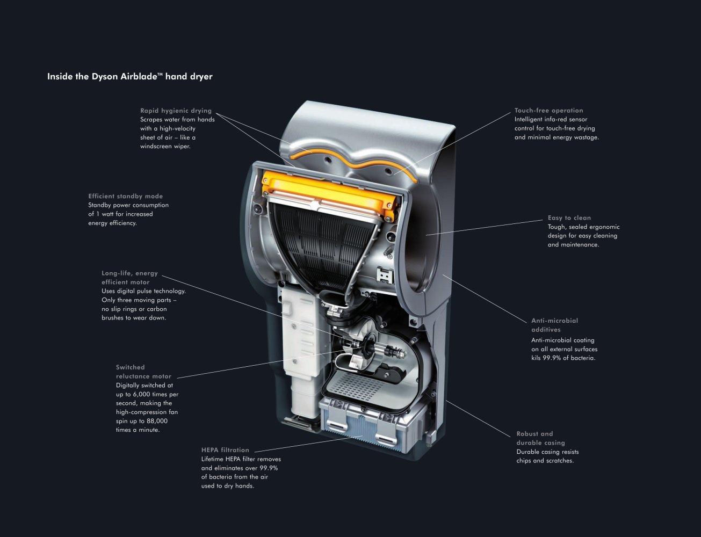

### Everything is about creating a **great product**

^ It is not about the WOW factor only, it is about creating a great product: https://speakerdeck.com/fcoury/design-for-developers (slide 17)

---

### What is **Software Engineering**?
### What is **Software Development**?
### What is **Coding**?

^ Software engineering is a field of engineering, for designing and writing programs for computers or other electronic devices. A software engineer, or programmer, writes software (or changes existing software) and compiles software using methods that improve it.

---

### "**Software engineering** is a field of engineering, for designing and writing programs for computers or other electronic devices."
#### by Wikipedia

---

### But this **love?/hate? story** is only for **designers** and **developers** 

---

### Job **underestimation**?

^ Let's put it this way: What it is easy for developers, it is not for designers (slide 4): https://speakerdeck.com/georgiknox/design-hacks-for-developers. There is a job underestimation from both sides (we will see that is not true)

---

How can **we** work together and **design/develop** cool products?

^ Behaviour and the personal factor comes to the surface when we need to team up and work together

---

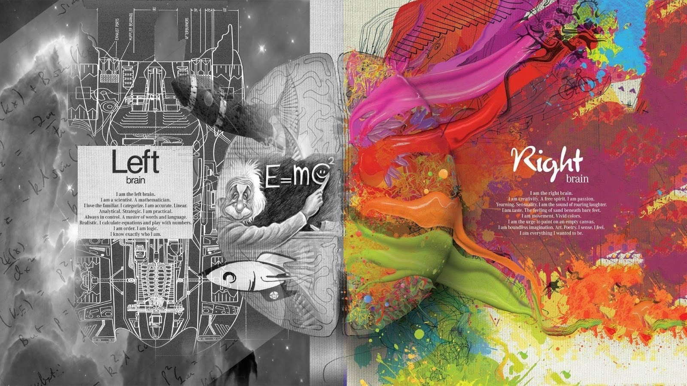

^ Let's explore the brain hemispheres to understand a little bit better what happens at this level. 
^ It looks like the brain is the perfect combination for achieving our goals right?
^ So we are compatible but at the same time incompatible...which makes a perfect? relationship. 

---

### This **love** story begins with...
#### (Some reserach says there are **7 stages** in a relationship)

^ According to some research there are different stages in a human love relationship
What are those stages then? Let me get started with the stages of any love relationship.

---

### Stage 1
### **Being Single**

---

## That moment of loneliness...

^ That moment of loneliness where you do everything yourself (get rid of those bad thoughts out of your mind here please: you go to the cinema by yourself for example: you do not share many activites with anyone else)

---

## That moment of loneliness...

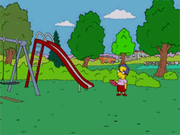

^ That moment of loneliness where you do everything yourself (get rid of those bad thoughts out of your mind here please: you go to the cinema by yourself for example: you do not share many activites with anyone else)

---

### What happens when a **developer tries to be a designer?** 

---

## Great Experience!

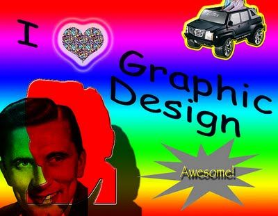

---

### What happens when a **designer tries to be a developer?**

---

## Bug free application!

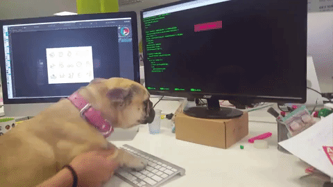

---

### Stage 2
### **The Date**

---

## Finding a partner...

^ Compatible/incompatible. Love at first sight
At some point you see that you cannot everything yourself and start a research.
	- Blind Date.
	- Someone introduced you a person.

---

## Blind date... It is a match!!!

---

### Stage 3
### **The Proposal**

^ In this stage, there are some compatible aspects but you still do not know each other.
	- You decide to start a relationship.
	- Long distance relationship (you are working remotely).

---

## A new hiring is here!

---

### Stage 4
### **The Engagement**

^ You learn to work with each other
^ In this stage everything seems perfect: 
	- You launch the perfect feature together.
	- Decide to run a life together. 
	- Attend conferences together. 
^ Little discussions happen but you avoid them
^ Love is involved here. You love working with each other.

---

### That pixel is perfect!
### **Love byte-code manipulation!**

^ Pixel perfect and bytecode manipulation become a big thing.  
^ How algorithms performs becomes a day-to-day topic. 

---

### Stage 5
### **Post-Engagement and first discussions**

^ You start having stronger discussions and things start to bother each other.

---

## First issues in the relationship...

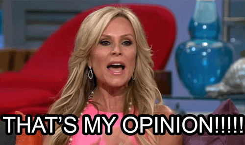

---

### Stage 6
### **Retirement and living together**

^ This is the easy part when everything works.
^ Not a big deal here: continuous improvement and work in harmony.

---

## Overall happiness...

^ This is the easy part when everything flows. 

---

### Stage 7
### **The break-up**

^ How can we avoid the break-up?
The pilars of any relationship: respect, communication, honesty, care, responsibility, patience.
Contributions as individuals are easier, but what happens when working as teams?

---

## The inevitable happens...

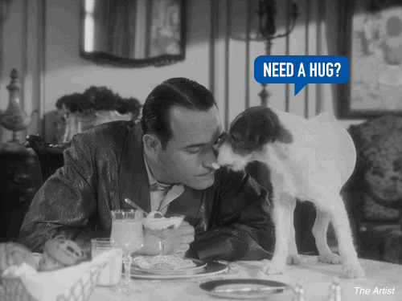

^ Lessons learned
^ The cycle stars again
^ Many times is inevitable but we can always get something positive and learnings out of it.

---

## How can we **avoid the break-up?**

- Respect.
- Communication. 
- Honesty.
- Care.
- Responsibility.
- Patience. 

^ How can we avoid the break-up?
The pilars of any relationship: respect, communication, honesty, care, responsibility, patience.
Contributions as individuals are easier, but what happens when working as teams?

---

## How can **developers** help **designers**?

- Give know-how on what is viable or not.
- Give an overview on how things work. 
- Provide constructive design critique.
- With a different perspective: based on experience or functionality.

^ Constraints
^ Provide a different perspective: more focused on the experience or functionality

---

## How can **designers** help **developers**?

- Use an actual asset management or version control system.
- Keep everything as vectors, and scaleable effects.
- Use the platform's idioms.
- Use realistic content.

^ Lorem ipsum is not found anywhere in the design

---

## How can we work **together**?

- Establish a clear and consistent workflow.
- Never assume it is easy.
- Don't micro manage.
- Mutual respect.
- Work in a harmonious, cross-collaborative environment.
- Creativity exists in both sides.
- Feedback is key from both sides.

^ Mutual respect gets rid of the us and them mindset. It helps develop better relationships by creating a happier environment.
^ We both approach problem from different angles. Creativity exists in both sides. 
^ http://uxmag.com/articles/so-agile-together

---

### Moral of the fable:

#### "**Better products** result when your creative mind and dev's analytical genius **work together.**"

#### "The creation of product is a partnership between **graphic design, interaction design, and implementation.** None of these disciplines is any less important than another, and **all are vital.**"

#### "**Design and development** are two inseparable halves of the process of creating **quality software.**"	

^ Everything is about communication. Work in harmony.
^ The creation of any kind of software is (or should be) a partnership between graphic design, interaction design, and implementation. None of these disciplines is any less important than another, and all are vital. By being aware of the needs of those working in other fields, we can be more effective and valuable in our own work.
^ Design and development are two inseparable halves of the process of creating quality software. Professionals on both sides should always strive to work together as effectively and respectfully as possible.
^ If I adapt to their processes, they adapt to my processes. If I respect their time, they respect my time, and if I get them involved, they’ll get me involved too. It works both ways. We all win.

---

## Q & A

---

## Thanks!

---

### References

#### **Articles:**
- http://humaan.com/dear-developer-love-designer/
- https://medium.com/@lukejones/designers-work-better-with-developers-ecd509a00d30#.9yyix3cg6
- http://blog.invisionapp.com/designer-developer-collaboration/
- https://uxmag.com/articles/the-relationship-between-designers-and-developers
- https://designmodo.com/designers-developers-work/
- http://www.dtelepathy.com/blog/business/developers-designers-should-work-together
- https://getflywheel.com/layout/designers-learn-to-code/
- https://www.invisionapp.com/blog/design-with-developers-in-mind/
- https://speakerdeck.com/andr3/designers-and-developers

#### **Presentations and pics:**
- https://speakerdeck.com/funsize/super-happy-mobile-product-design-time
- https://speakerdeck.com/search?utf8=%E2%9C%93&q=mobile+product+design
- http://www.inspirefusion.com/funny-yet-creative-conceptual-love-story-photography/
